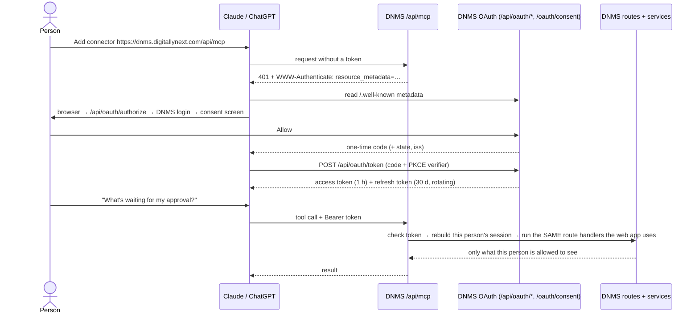

# DNMS AI connector (MCP + OAuth): Claude, ChatGPT and other agents

**Status:** Built and tested locally on 2 Oct 2026; tested with Claude Code locally and committed on 3 Oct 2026. **Deploy steps in §3.**
**Decision (Karan, 2 Oct 2026):** through the connector, an AI app can do **everything the connected person can do in DNMS**. That covers every module, read and write, limited only by that person's own role and permissions. The superadmin/platform layer is the exception. This replaces the earlier draft's "Phase 1 read-only, no salary" plan.

---

## 1. What it is, in one paragraph

DNMS now has an **MCP server** at `https://dnms.digitallynext.com/api/mcp`. MCP (Model Context Protocol) is the standard that Claude, ChatGPT, Claude Code, Codex, Cursor and others use to connect to apps. Here is how it works:

1. A person adds that URL in Claude or ChatGPT.
2. The AI app sends them to the normal DNMS login, then to a DNMS consent screen ("Claude wants to access DNMS as you" → **Allow**).
3. DNMS gives the app a token that acts **as that person**.
4. From then on, the person can ask in plain English, for example:
   - "Who's away this week?"
   - "What's waiting for my approval?"
   - "Approve Riya's leave for Friday."
   - "Show overdue deliverables on Project X."

   The AI calls DNMS live to answer, with exactly that person's permissions.

---

## 2. How it works

**Why "everything" is safe to offer.** The AI does not get its own database access or its own rules. A tool call runs the **same API route handlers the DNMS web app calls**, in-process, as the connected person. That works through a small "delegated session" that `getSession()` checks first (`server/delegated-session.ts`). As a result:

- Every existing check applies unchanged: `withAuth`, `requirePermission`, "is this your project", "is this your direct report", the company (tenant) guard.
- Audit logging works unchanged, because `createAuditLog` sees the real person.
- A plain employee's AI gets 403 wherever the employee would; an HR manager's AI sees what HR sees.
- Roles, deactivation and password changes are re-checked **on every call**, so a change applies immediately.

**What the AI can never reach**, even for an admin (`features/mcp/server/api-policy.ts`):

- **Superadmin / platform layer:** platform settings and integration secrets, platform storage accounts, and the platform console.
- **Stored secrets:** the project password-vault "reveal" and decrypted ad-platform credentials.
- **Machine and sign-in endpoints:** NextAuth, password change/reset, cron jobs, the public website APIs, the biometric push hook, live event streams.
- **Other accounts and itself:** the client portal (client accounts only), the connector's own OAuth endpoints, and connection management.
- **Files:** uploads and downloads. The AI is told to use the web app for those.

**Tools the AI sees (8):**

| Tool | What it does |
|---|---|
| `whoami` | Who the connection acts as: workspace, roles, permissions. Also ChatGPT's profile tool. |
| `dnms_dashboard` | The person's dashboard, plus the company dashboard if they have `dashboard:read` |
| `dnms_my_approvals` | Everything waiting for this person: team leave and WFH (company-wide for HR), resignations, floating holidays, exit clearances |
| `dnms_who_is_away` | Company holidays, people on leave or floating holiday, and approved WFH for a date range. Never shows the leave type. |
| `dnms_search_people` | Search the employee directory (needs `employee:read`) |
| `dnms_find_endpoints` | Search the catalogue of **304 DNMS API endpoints**: path, methods, query params, body fields, required permission |
| `dnms_get` | Read any of those endpoints |
| `dnms_change` | POST/PUT/PATCH/DELETE any of those endpoints. Marked destructive, so Claude and ChatGPT ask the person before running it. |

The endpoint catalogue is generated from the code by `scripts/generate-mcp-api-map.ts`. It reads each route's own doc comments, query parameters, and the zod schema its service validates with, and runs automatically before `pnpm dev` and `pnpm build`. **New DNMS routes become available to the AI on the next build, with no tool changes**, which matters because ChatGPT Business freezes an app's tool list when it is published.

---

## 3. Deploy checklist (Karan)

1. **Database:** the migration `20261002000000_ai_connector` (five new tables, additive only) is **already applied** to the database in `.env`, which is the shared server database. `prisma migrate deploy` will report it as up to date.
2. **Deploy as usual.** `pnpm install` picks up the new dependency, `@modelcontextprotocol/server`.
3. **Environment on the server:**
   - Add `APP_PUBLIC_ORIGIN=https://dnms.digitallynext.com`. It is the OAuth issuer and the token audience; changing it later disconnects every AI app.
   - Optional: `MCP_ALLOWED_REDIRECT_ORIGINS`, to allow other AI apps' callback addresses.
4. **nginx:** make sure these reach Node:
   - `/api/mcp`, `/api/oauth/*` and **`/.well-known/oauth-*`**. Many nginx configs deny dot-paths (`location ~ /\.`) or reserve `/.well-known/` for certbot; add a `location ^~ /.well-known/oauth-` that proxies to the app.
   - For `/api/mcp`, set `proxy_buffering off;` and `proxy_read_timeout 300s;`, because responses can stream.
5. **Firewall:** Claude calls from `160.79.104.0/21`, and ChatGPT from OpenAI's published egress ranges. Both must reach the site over HTTPS.
6. **Smoke test after deploy:**
   - `curl https://dnms.digitallynext.com/.well-known/oauth-authorization-server` should return JSON whose `issuer` is `https://dnms.digitallynext.com`.
   - `curl -i -X POST https://dnms.digitallynext.com/api/mcp` should return `401` with a `www-authenticate: … resource_metadata="https://dnms.digitallynext.com/.well-known/oauth-protected-resource/api/mcp"` header.
7. **Connect for real.** Open **AI Connections** in the DNMS sidebar for the URL and steps, then connect Claude (Customize → Connectors → Add custom connector). The first connection is also the first real browser test of the Allow button; see §6.

---

## 4. How people connect

The **AI Connections** page in DNMS (`/ai-connections`, in everyone's sidebar) shows the URL and these steps, plus the person's connections with a Disconnect button. People holding `role:write` also see **everyone's** connections and can disconnect them.

- **Claude Pro/Max:**
  1. Customize → Connectors → **+** → Add custom connector.
  2. Paste the URL and click Connect.
  3. Log in to DNMS and click Allow.
- **Claude Team/Enterprise:** an Owner adds it once under Organization settings → Connectors. Each person then clicks Connect.
- **ChatGPT Business/Enterprise:**
  1. An admin enables Developer mode.
  2. The admin goes to Workspace settings → Apps → Create, pastes the URL, chooses OAuth and runs **Scan Tools** (which includes logging in and clicking Allow).
  3. The admin publishes it.
  4. Each person enables it under Settings → Apps.
  - ChatGPT Pro is read-only in developer mode, and the ChatGPT mobile app can't use custom apps.
- **Claude Code:**
  1. Run `claude mcp add --transport http dnms https://dnms.digitallynext.com/api/mcp`.
  2. Run `/mcp` and choose dnms.
  3. Log in to DNMS and click Allow.
- **Disconnecting:** use AI Connections in DNMS, or the AI app's own settings. Either way it takes effect on the very next call.

---

## 5. Security design (what was implemented)

**OAuth 2.1 authorization server inside DNMS** (`features/mcp/server/`). It follows MCP spec revision **2026-07-28**, plus Claude's and ChatGPT's published requirements.

**Discovery:**
- RFC 9728 Protected Resource Metadata at `/.well-known/oauth-protected-resource/api/mcp` and at the root path.
- RFC 8414 Authorization Server Metadata.
- A 401 from `/api/mcp` with a `WWW-Authenticate` pointer.

**How an AI app identifies itself:**
- **CIMD (preferred):** the app's `client_id` is an https URL that DNMS fetches, with SSRF protection (https only, no redirects, private IPs blocked, 5 s timeout, 64 KB limit) and a 24-hour cache.
- **DCR:** deprecated by the spec but kept for older agents.
- Verified live against **Claude Code's** and **ChatGPT's** real client metadata documents.

**Where a code may be sent.** It must be a redirect URI the app declared; loopback addresses match on any port, for Claude Code and other command-line agents. It must also be on an allowlist: `claude.ai`, `chatgpt.com`, loopback, plus `MCP_ALLOWED_REDIRECT_ORIGINS`. So a DNMS token can only ever reach Claude, ChatGPT, or a program on the person's own machine.

**Codes and the authorization response:**
- PKCE S256 only.
- One-time codes that expire after 60 seconds.
- Replaying a code revokes the connection.
- `iss` is returned on every authorization response (RFC 9207), which lets ChatGPT use its stable redirect.
- Tokens are bound to `resource` (RFC 8707).

**Tokens:**
- Opaque random strings (`dnms_at_…`, `dnms_rt_…`); only their SHA-256 hashes are stored.
- Access tokens last 1 hour.
- Refresh tokens last 30 days and are **rotated** on every use. Reusing an old one after the 60-second race window revokes the connection.
- RFC 7009 revocation.

**Consent screen** (`/oauth/consent/[id]`):
- Login-protected.
- Shows the app, where the code returns to, a verified or unverified badge, who you are connecting as, and the access being granted.
- Allow and Deny are server actions, so they get Next's origin check.

**Re-checked on every MCP call:**
- the token is valid and not revoked;
- the membership, user, employee and company are still active;
- the password has not changed since connecting;
- roles and permissions, loaded live from the database.

**Usage log (`mcp_tool_calls`):**
- Records the tool, the target route, the status and the duration.
- **Never records arguments or results**, which can contain personal data.
- Purged after 90 days.
- Skipped for the hidden `admin_` account; its connections also don't appear in admin lists, which is consistent with the invisibility rule.

**Audit:** `ai_connector:connect` and `ai_connector:disconnect` entries. Every change made through the AI is audited by the existing routes, as the person.

**Rate limits** (in-memory, per Node process):

| Limit | Value |
|---|---|
| Tool calls | 300 per 5 min per connection |
| Token endpoint | 120 per min per IP |
| Authorize | 60 per min per IP |
| DCR registrations | 20 per hour per IP |

---

## 6. What was tested (2 Oct 2026)

These ran against a local dev server on the shared database. Only reads were made, plus deliberately invalid writes that change nothing. Every test row was deleted afterwards.

**Discovery and errors:**
- [x] Both metadata documents are correct. `/api/mcp` without a token returns 401 with the right `WWW-Authenticate`; a bad token also returns 401.
- [x] DCR works, and a redirect off the allowlist is refused.
- [x] Authorize sends the browser to the consent page. A missing PKCE value goes back to the app with an error, and an unregistered redirect shows an error page.
- [x] The consent page sends a logged-out user to `/login?callbackUrl=/oauth/consent/<id>`.

**Real clients:**
- [x] Real CIMD documents from `claude.ai` (Claude Code) and `chatgpt.com` (ChatGPT) are fetched, validated and matched to their callbacks.

**The Allow and token path:**
- [x] The real `approveAuthorization` path issues code + state + iss, puts the grant in the right company, and writes the audit row.
- [x] Code exchange works. A wrong verifier fails, and the code is single-use, with a replay revoking the connection.
- [x] Refresh rotates, an old refresh token is refused, and the new access token works.

**Tools and permissions:**
- [x] All 8 tools work end to end (≈0.4–1 s each).
- [x] Permission parity:
  - a plain-employee connection gets 403 on the audit log and the directory;
  - it sees only its own salary structure;
  - a read-only connection can't write.
- [x] Policy blocks: settings, cron and vault-reveal are unreachable.
- [x] Revocation: a disconnected token gets 401 immediately.
- [x] The write path reaches the real services (validation errors come back), with nothing written.

**Pages and checks:**
- [x] The consent page and the AI Connections page render with a real session.
- [x] `pnpm type-check`, eslint, the full test suite (746 tests, 20 of them new) and a production build all pass.

**Not tested:**
- [ ] **Clicking Allow in a real browser** (the server action) and a live Claude/ChatGPT connection. These need the deployed HTTPS site and a real login, so do them at step 7 of §3.

---

## 7. Risks and caveats

1. **Data passes through Anthropic or OpenAI.** With the "everything" rule, an HR person's AI can read salaries and personal details, because HR can. Get management sign-off, tell staff, and use business plans that don't train on your data. Consider India's DPDP Act obligations.
2. **The AI can be wrong.** The data it receives is exact, but its summary can misread it. Check pay, disciplinary or legal decisions in DNMS.
3. **Prompt injection.** Text other people wrote (leave reasons, comments, public job applications) could try to instruct the AI. These measures limit it:
   - the AI is told to treat that text as data;
   - writes go through a separate tool that the AI apps confirm with the person;
   - every write is still bounded by the person's own permissions.
4. **We own security-sensitive code** (the token issuer). It follows the spec closely and was tested; WorkOS Connect is the fallback if we'd rather not own it.
5. **Spec churn.** The July 2026 revision changed the transport and deprecated DCR. The SDK serves both old and new clients. Expect a small update roughly once a year.
6. **Single-process limits.** Rate limits are per Node process; move them to the DB or Redis if DNMS ever runs more than one instance.
7. **Any staff member can connect.** That is fine, because they only get their own permissions. To restrict it, gate `approveAuthorization` on a permission; it's a few lines.

---

## 8. Files

| Area | Files |
|---|---|
| Session bridge | `server/delegated-session.ts`, plus 2 lines in `getSession()` (`server/api-handler.ts`). `getUserWithPermissions` is now exported from `server/auth.ts`. |
| OAuth server | `features/mcp/server/{oauth.service,clients.service,tokens,redirects,config,http}.ts` |
| MCP server | `features/mcp/server/{mcp-server,principal,api-dispatch,api-policy,usage}.ts`, plus the generated `api-routes.generated.ts` |
| Routes | `app/api/mcp`, `app/api/oauth/{authorize,token,register,revoke}`, `app/.well-known/oauth-{protected-resource,authorization-server}`, `app/api/ai-connections` |
| Pages | `app/(auth)/oauth/consent/[id]`, `app/(dashboard)/ai-connections` |
| UI | `features/mcp/components/{consent-card,ai-connections-client}.tsx`, `features/mcp/hooks/use-ai-connections.ts`; nav entry in `config/nav.ts` |
| Routing | `proxy.ts` (`PUBLIC_PREFIXES`: `/api/mcp`, `/api/oauth`, `/.well-known`), `lib/tenant-url.ts` (`oauth` global, `ai-connections` tenant-scoped) |
| Database | `prisma/schema.prisma` (5 models), `prisma/migrations/20261002000000_ai_connector` |
| Catalogue | `scripts/generate-mcp-api-map.ts` (`pnpm mcp:api-map`) |
| Tests | `features/mcp/lib/route-match.test.ts`, `features/mcp/server/oauth-rules.test.ts` |
| Env | `.env.example`: `APP_PUBLIC_ORIGIN`, `MCP_ALLOWED_REDIRECT_ORIGINS` |

---

## 9. Sources (checked 1–2 Oct 2026)

- MCP Authorization spec 2026-07-28: https://modelcontextprotocol.io/specification/2026-07-28/basic/authorization
- July 2026 revision analysis (Descope): https://www.descope.com/blog/post/july-2026-mcp-revision
- OpenAI, *Authenticate your users*: https://developers.openai.com/plugins/build/auth
- OpenAI Help, *Developer mode and MCP apps in ChatGPT*: https://help.openai.com/en/articles/12584461-developer-mode-and-mcp-apps-in-chatgpt
- Claude, *Authentication for connectors*: https://claude.com/docs/connectors/building/authentication
- Claude Help, *Custom connectors using remote MCP*: https://support.claude.com/en/articles/11175166-get-started-with-custom-connectors-using-remote-mcp
- MCP TypeScript SDK v2 (`@modelcontextprotocol/server`): https://github.com/modelcontextprotocol/typescript-sdk
- WorkOS Connect (fallback option): https://workos.com/changelog/standalone-oauth-for-mcp
